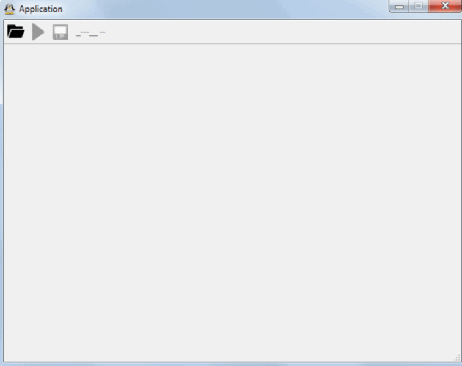

# Automatic number-plate recognition (ANPR)

The project was made in 2018.

* The first stage of the system is the number-plate detection. You can watch a short video here [YouTube](https://www.youtube.com/watch?v=Y9FtcxOLk1M). This step is done by YOLOv3.
* The second stage is the text detection. This step is done by [AdvancedEAST](https://github.com/huoyijie/AdvancedEAST).
* The third stage is the character recognition. This step is done by [Tesseract OCR](https://github.com/tesseract-ocr/tesseract).

Python environment can be recreated using _PlateDetection.yml_ file.
Files from the _tesseract_ folder, weights for AdvancedEAST and weights for YOLOv3 were excluded from the repository due to their large weight.
___

### Training of YOLOv3

The training/testing data were collected from the Internet, some were manually uploaded, 
and some were automatically parsed. In total there were 11100 images of different sizes.

These images were manually labeled using [OpenLabeling](https://github.com/Cartucho/OpenLabeling/) tool.
It was chosen for labeling because it supports **Pascal VOC** annotation format. 
Then, YOLO was trained using these images.

